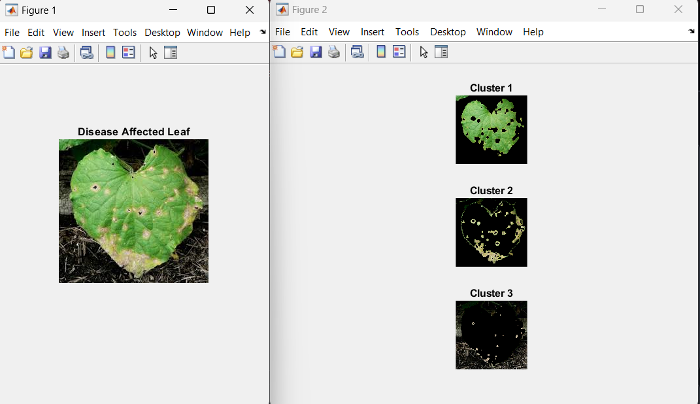

# 🌿 Plant Leaf Disease Detection using MATLAB

This project uses **MATLAB** and image processing techniques to detect and segment **diseased regions** in plant leaves automatically. The approach leverages the **Lab color space** and **K-Means clustering** for robust, unsupervised detection of disease-affected areas.

---

## 📌 Features

- ✅ Automatic detection of diseased regions
- 🧠 Uses Lab color space (`a*`, `b*` channels) for color-based segmentation
- 🤖 K-Means clustering for adaptive thresholding
- 🧼 Morphological operations for mask refinement
- 📊 Visual outputs for original image, segmented region, and analysis

---


## 🧪 How It Works

1. User selects a diseased leaf image.
2. Convert image to **Lab color space** using `rgb2lab()`.
3. Extract `a*` and `b*` channels as features.
4. Reshape color data and apply **K-Means clustering** (`k = 2`).
5. Select the cluster with fewer pixels (assumed to be the diseased region).
6. Refine binary mask:
   - Median filtering
   - Hole filling
   - Noise removal
7. Apply the mask on the original image to isolate diseased area.
8. Display and save results.

---

## 🛠 Requirements

- MATLAB R2018 or later
- Image Processing Toolbox

---
<p align="center">
  
</p>
## 🚀 How to Run

1. Clone this repository:
   ```bash
   git clone https://github.com/yourusername/plant-disease-detection-matlab.git
   cd plant-disease-detection-matlab
